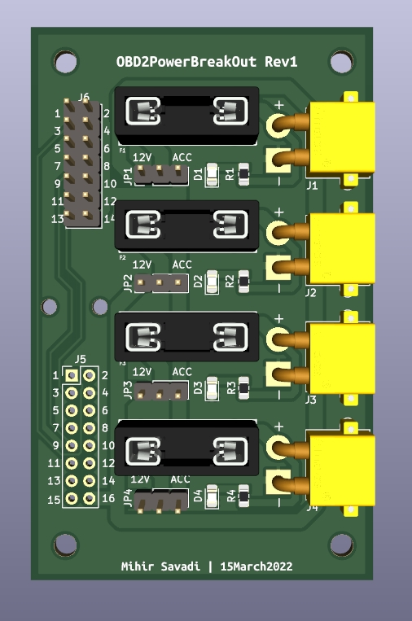
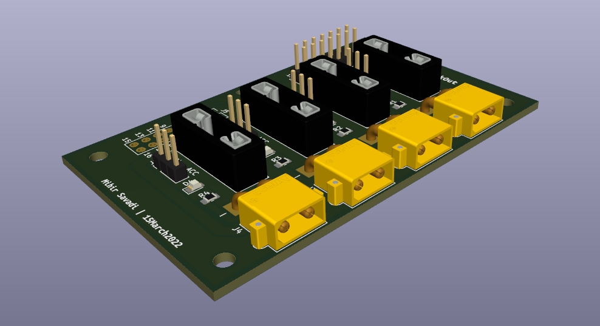

# OBD2PowerBreakOut Board

A simple breakout board that uses inputs from an OBD2 pigtail, and breaks them out with a series of XT30PW connectors.
Each power channel is fuse protected with standard automotive fuses, includes an LED to for easy FUSE integrity
checking, and selectability between 'always on' or 'only on after ignition'. The aforementioned selectability is
accomplished by jumping two pins -- this is self-descriptive on the pcb.

The PIN that connects to power only upon ignition differs between brands. This pin is called the ACC pin. You will have
to research and find out which PIN corresponds to your specific ACC pin. You can also use a multimeter to test and find
out. Below is the standard pinout for an OBD2 connector -- the ACC pin can only exist on any one of the vendor specific
pins. For my 2004 Land Rover Discovery II, the ACC pin is located at pin ???.

The color codes in the following pin-out are in reference to the pigtail found here --
https://www.amazon.com/dp/B07F16GPMB?ref=ppx_yo2_dt_b_product_details&th=1 (iKKEGOL 16 Pin J1962 OBD2 OBD-II Male Connector to Open Plug Wire, OBD Diagnostic Extension Cable Pigtail for DIY (60cm 24" inch, 2ft))
1. **Black** Vendor  
2. **Brown** - J1850 Bus+
3. **Red** - Vendor
4. **Orange** - chassis ground
5. **Yellow** - signal ground
6. **Green** - CAN high
7. **Blue** - K-line
8. **Purple** - Vendor
9. **Gray** - Vendor
10. **White-** J1850 BUS
11. **Pink** - Vendor
12. **Teal** - Vendor
13. **Black/White** - Vendor
14. **Brown/White** - CAN low
15. **Red/White** - K line low
16. **Green/White** - Battery

XT30 connectors are used in this board for easy jerry-rigging of accessories -- XT30's are easy to source, easy to
install, and reliable.

I permanently run an UltraGauge to monitor various information in real time, and as such needed more than just 1 OBD2
port in order to run the OBD2_PowerBreakOut board. I simply used a Y splitter like this one --
https://www.amazon.com/gp/product/B07K6MWQTB/ref=ppx_yo_dt_b_search_asin_title?ie=UTF8&psc=1.

Below are some screenshots of the rendering of the assembled board. I will include real-life photos once assembled.

